**Creative Coding I: Design & Communication**

Anna Eschenbacher | anna.eschenbacher@filmuniversitaet.de | Film University Babelsberg _KONRAD WOLF_

---

# Script 07: Three.js

-   [Script 07: Three.js](#script-05-the-web)
    -   [What is Threejs](#What-is-Three.js)
        -   [WebGL](#WebGL)
        -   [Three.js](#Three.js)
        -   [Alternatives](#Alternatives)
    -   [Example projects](#Example-projects)
    -   [Building your first scene](#Building-your-first-scene)
        -   [HTML](#html)
            -   [HTML5](#html5)
    -   [Summary](#summary)
    -   [References](#references)

---

## What is Three.js

### WebGL
WebGL is a JavaScript API for rendering interactive 2D and 3D graphics. It is executed on a computer's GPU. It consist of control code written in JavaScript and shader code that is written in OpenGL ES Shading Language (GLSL ES), a language similar to C or C++.

### Three.js
Three.js is an **open-source library** and **API** using WebGL. It is used to create and display animated 3D graphics in a web browser. It simplifies the creation of WebGL tools and environments.

### Alternatives
3D Graphics: [babel.js](https://babeljs.io)

2D Graphics: [p5.js](https://p5js.org/), [pixi.js](https://www.pixijs.com/) 

## Example projects

-   [cat](https://codepen.io/Yakudoo/pen/oXJYxy) <br>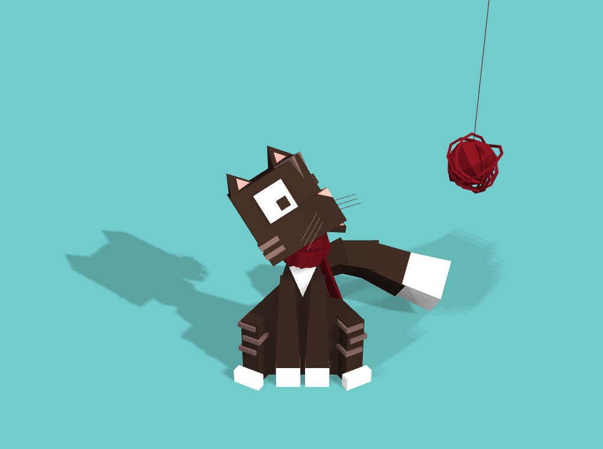
-   [noise blob](https://codepen.io/vcomics/pen/ZwNgvX?editors=1010) <br>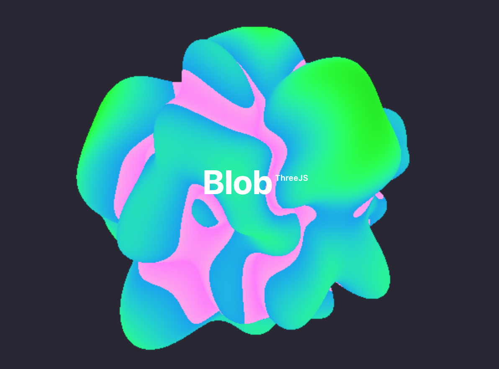
-   [Kid TV Scene (loading 3D model)](https://codepen.io/SaschaSigl/pen/gpVKOa?editors=0010) <br>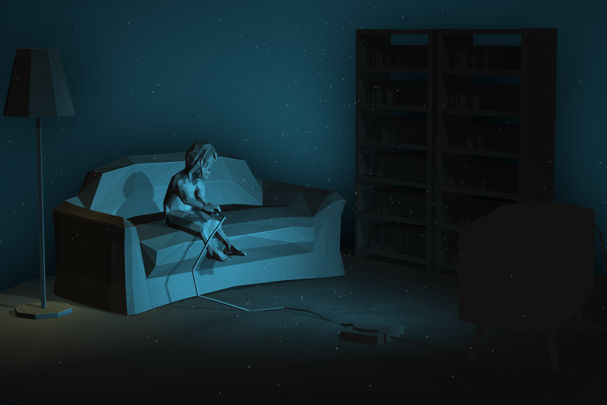
-   [rain](https://codepen.io/iondrimba/pen/EMwvgE) <br>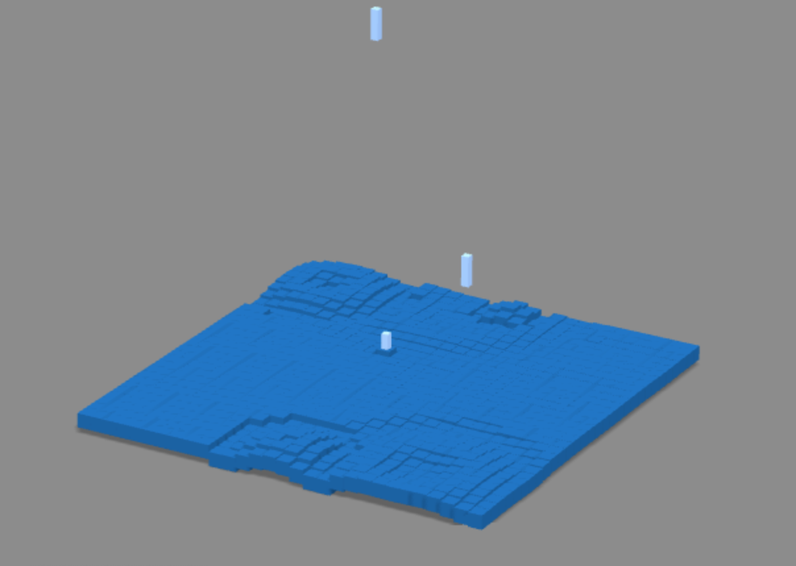
-   [plane animation](https://codepen.io/ste-vg/pen/GRooLza?editors=0010) <br>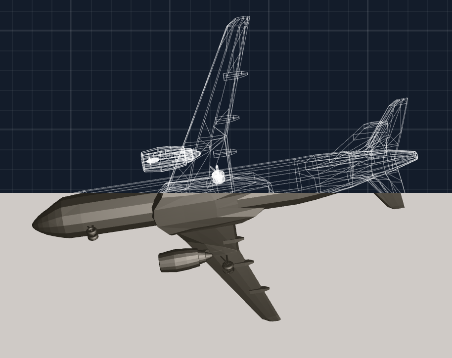

-   [clipping](https://threejs.org/examples/#webgl_clipping_stencil) <br>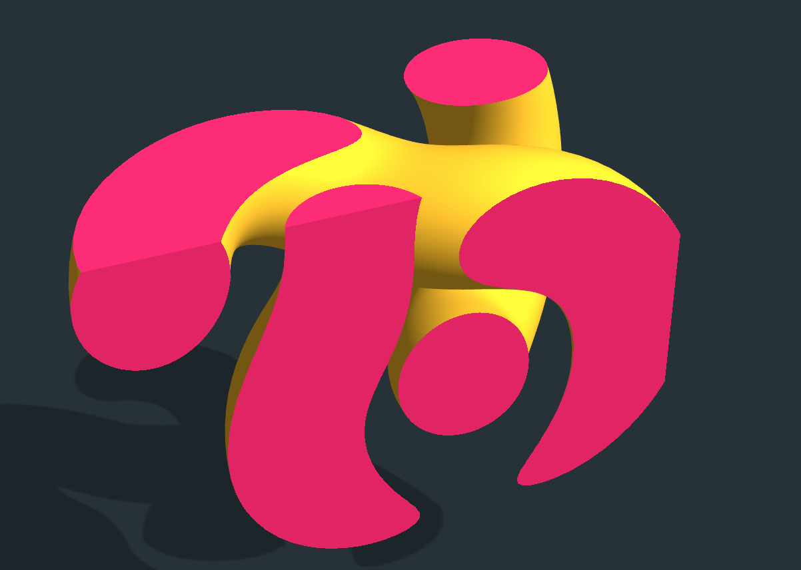
-   [instancing](https://threejs.org/examples/#webgl_buffergeometry_instancing) <br>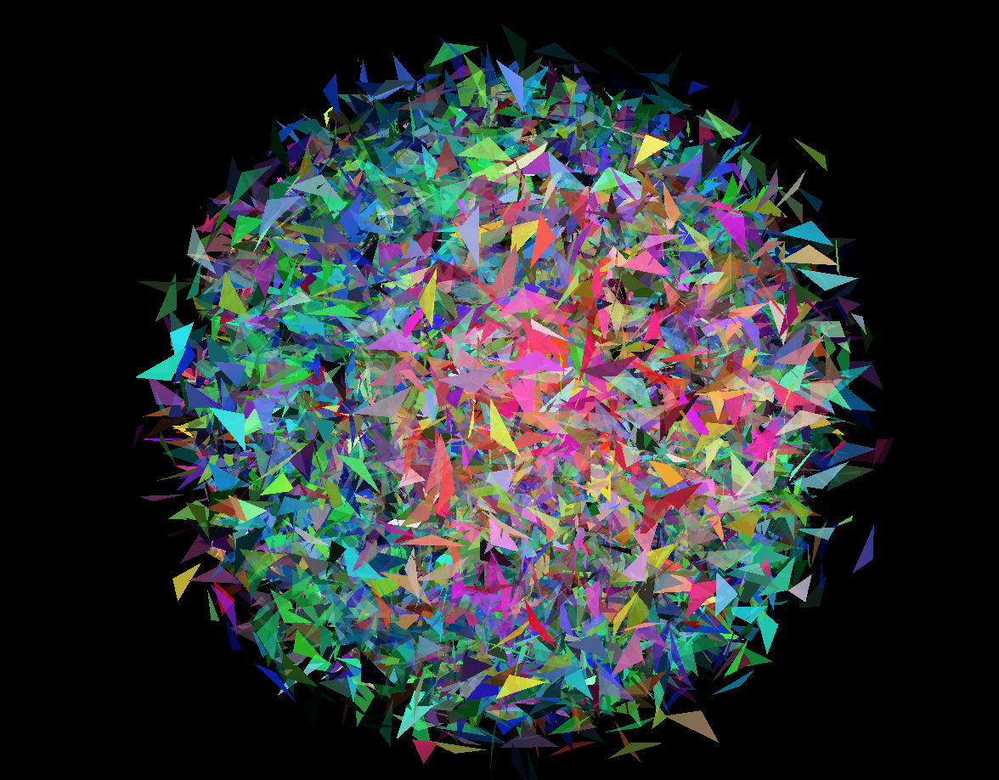
-   [postprocessing](https://threejs.org/examples/#webgl_postprocessing_unreal_bloom) <br>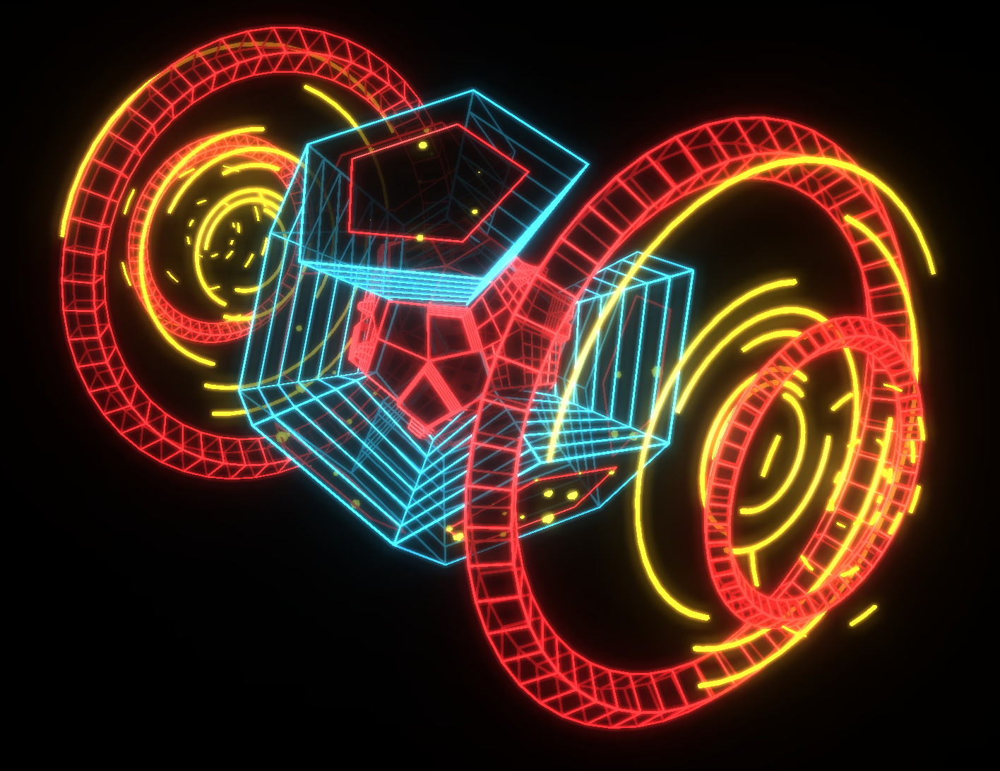
-   [portfolio website](https://bruno-simon.com/) <br>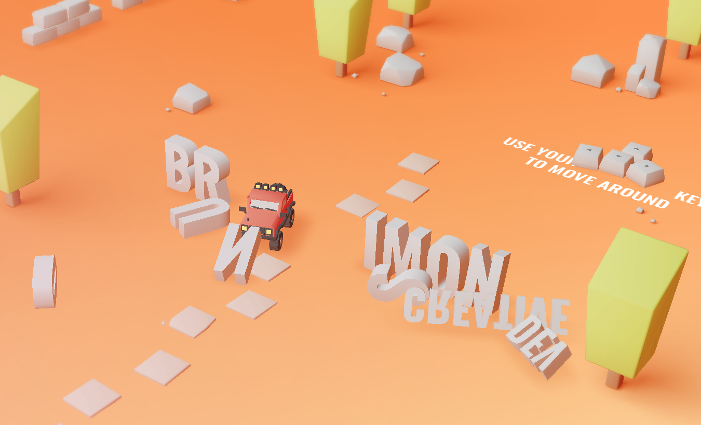
-   [agency website](https://lusion.co/) <br>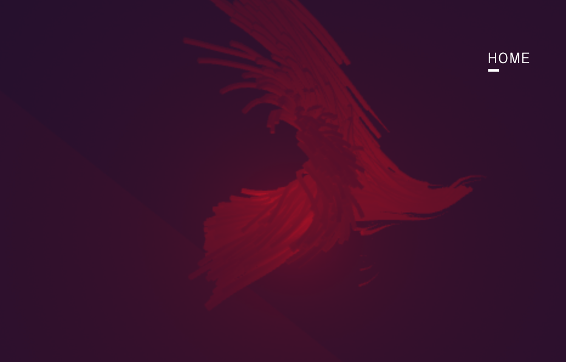
-   [storytelling: oat the goat](http://oatthegoat.co.nz/) <br>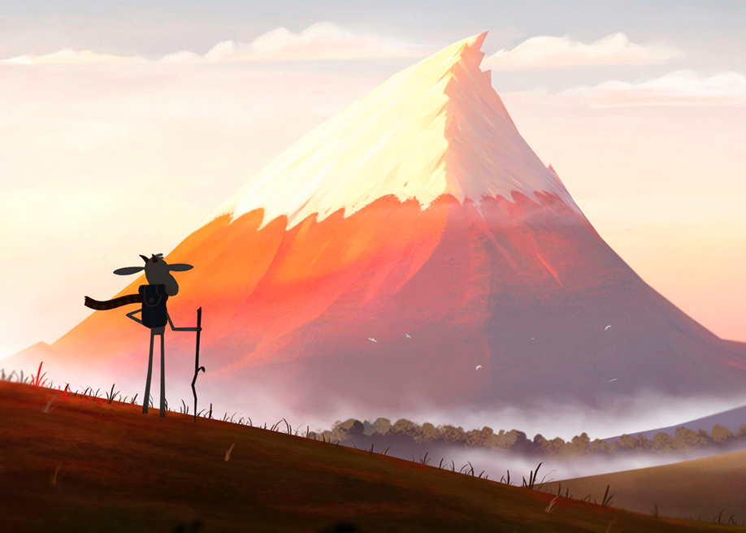
-   [real time short film](http://www.dilladimension.com/)
-   [my orientation project](https://shapedbymotion.herokuapp.com/) <br>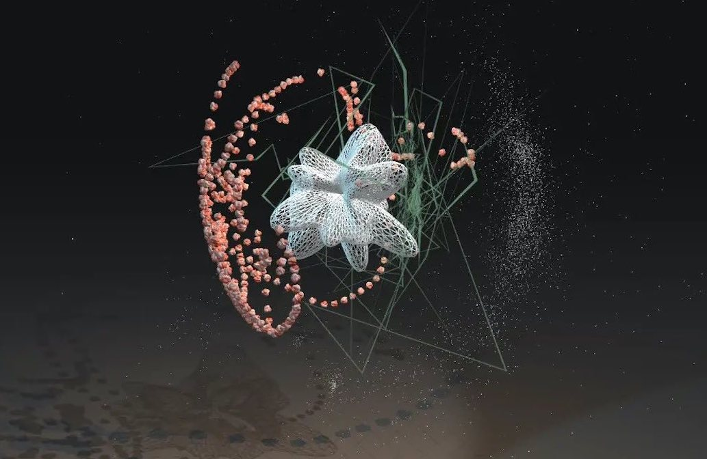

-   [more examples](https://threejs.org/examples/#webgl_animation_keyframes)
-   [more features on the three.js website](https://threejs.org/)

## Building your first scene

### Setup

Folder structure

```js
- threejs
    - css
        - style.css
    - lib
        - three.min.js
        - dat.gui.min.js
        - OrbitControls.js
    - workshop
        - index.html
        - canvas.js
        - data
            - texture.jpg
```

Our css file:
```css
html,
body {
    margin: 0;
    padding: 0;
}

canvas {
    display: block;
}
```

Our html file:
```html
<!DOCTYPE html>
<html>

<head>
    <meta charset="UTF-8">
    <title>Three js workshop</title>

    <link rel="stylesheet" type="text/css" href="../css/style.css">
    <link rel="shortcut icon" type="image/x-icon" href="../favicon.ico">

    <!-- Three.js -->
    <script src="../lib/three.min.js"></script>
    <!-- <script src="http://mrdoob.github.com/three.js/build/three.min.js"></script> -->

    <!-- dat.GUI -->
    <script src="../lib/dat.gui.min.js"></script>

    <!-- Orbit Controls -->
    <script src="../lib/OrbitControls.js"></script>
</head>

<body>
    <script src="canvas.js"></script>
</body>

</html>
```
We import the necessary libraries either locally or from an URL. Generally it makes sense to download the script, in case changes are made to the online version. Otherwise this might cause errors in your project. We are using some minified libraries. They are contentwise the same just smaller in file size.

We also call our ```canvas.js``` file, where we will put in our Three.js code.

To run this project we will use the same extensions as Lena did - [live server](https://marketplace.visualstudio.com/items?itemName=ritwickdey.LiveServer) for VSCode.


Now the fun part begins - let's get started with our ```canvas.js``` file.

To actually be able to display anything with three.js, we need three things: scene, camera and renderer, so that we can render the scene with camera.

```js
// SCENE
let scene = new THREE.Scene();
scene.background = new THREE.Color('#a6a6a6');

// CAMERA
let camera = new THREE.PerspectiveCamera(75, window.innerWidth / window.innerHeight, 0.1, 1000);
camera.position.z = 10;

// RENDERER
let renderer = new THREE.WebGLRenderer({ antialias: true });
renderer.setSize(window.innerWidth, window.innerHeight);
renderer.shadowMap.enabled = true;
renderer.shadowMap.type = THREE.PCFSoftShadowMap;

document.body.appendChild(renderer.domElement);

// make sure the scene adjusts to the browser window size
window.addEventListener('resize', () => {
    renderer.setSize(window.innerWidth, window.innerHeight);
    camera.aspect = window.innerWidth / window.innerHeight;
    camera.updateProjectionMatrix();
});
```
There are a few different cameras in Three.js. We will use a PerspectiveCamera since its projection mode is designed to mimic the way the human eye sees.

**PerspectiveCamera( fov : Number, aspect : Number, near : Number, far : Number )**

The first attribute is the **field of view**. FOV is the extent of the scene that is seen on the display at any given moment. The value is in degrees. 

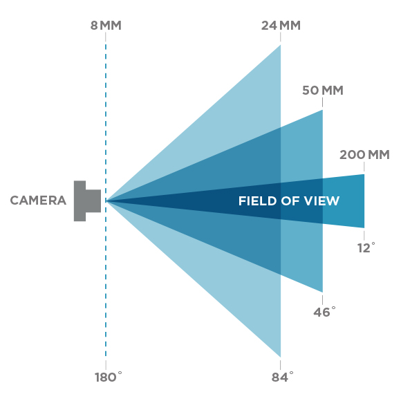

The second one is the **aspect ratio**. You almost always want to use the width of the element divided by the height, otherwise you'll get a distorted image.

The next two attributes are the **near and far clipping plane**. What that means, is that objects further away from the camera than the value of **far** won't be rendered. Same applies to objects closer than the **near** value. This is mainly used for better perfomance.

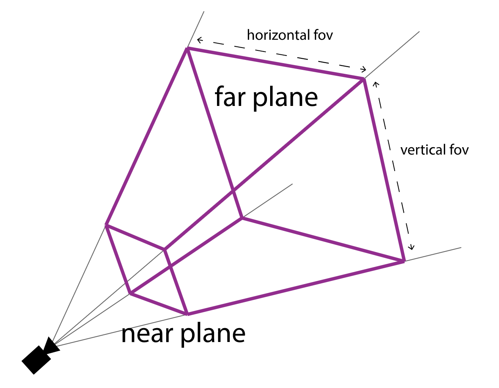

Next up is the **renderer**. We will use the WebGLRenderer. Three.js comes with a few others, often used as fallbacks for users with older browsers or for those who don't have WebGL support for some reason.

We also need to **set the size** at which we want it to render our app. It is best to use the width and height of the area we want to fill with our app - in this case, the width and height of the browser window.

We already added some details about shadows here. We will get back to this later.

We need to add the renderer element to our HTML document with ```document.body.appendChild(renderer.domElement);```

As a last step, we add an EventListener for the browser window size. This ensures a responsive Three.js scene, when the size changes.

Now we have a scene, a camera, and renderer. Let's put something into our scene.

Often times the first object is a cube, but let's go with an icosahedron, which is a much fancier shape.
If you prefer a cube you can exchange the let ```geometry = ..``` line with ```let geometry = new THREE.BoxGeometry();``` instead.

```js
// GEOMETRY
let icosaGeometry = new THREE.IcosahedronGeometry(1.5, 0); 
let icosaMaterial = new THREE.MeshStandardMaterial({ color: 0xaa5e82, roughness: 0.2 });
let mesh = new THREE.Mesh( icosaGeometry, icosaMaterial );
mesh.castShadow = true;
// add the mesh to the scene
scene.add(mesh);
```
To create a icosahedron, we need a **THREE.IcosahedronGeometry(radius, detail)**. This is an object that contains all the points (vertices) and fill (faces) of the icosahedron. Three.js offers a few basic and some more complex geometric shapes.

We will also need a **material** to color it. Three.js comes with several materials, but we'll use the MeshStandardMaterial for now. All materials can be filled with certain attributes to change the look. This can be color, roughness, as well as a texture.

The third thing we need is a **Mesh**. A mesh is an object that takes a **geometry**, and applies a **material** to it, which we then can insert to our **scene**, and move freely around.


By default, when we call scene.add(), the thing we add will be added to the coordinates (0,0,0). This is why we moved the camera back a bit earlier.

To be able to see anything we still need some light. There are a few different [lights](https://threejs.org/examples/?q=light#webgl_lights_hemisphere) like ambient light, directional light, point light, spot light. First, will use an ambient light to illuminate the whole scene.

```js
// LIGHTING
let ambientLight = new THREE.AmbientLight(0xffffff, 0.8); // (color, intensity)
// add the ambient light to the scene
scene.add(ambientLight);
```

Now we will add an animate or render loop similar to the draw() loop in p5.js. This will create a loop that causes the renderer to draw the scene every time the screen is refreshed (typically around 60 times per second). 

```js
// ANIMATE LOOP
function animate() {
    requestAnimationFrame(animate);
    renderer.render(scene, camera);
}
animate();
```

Let's have a look at our scene:

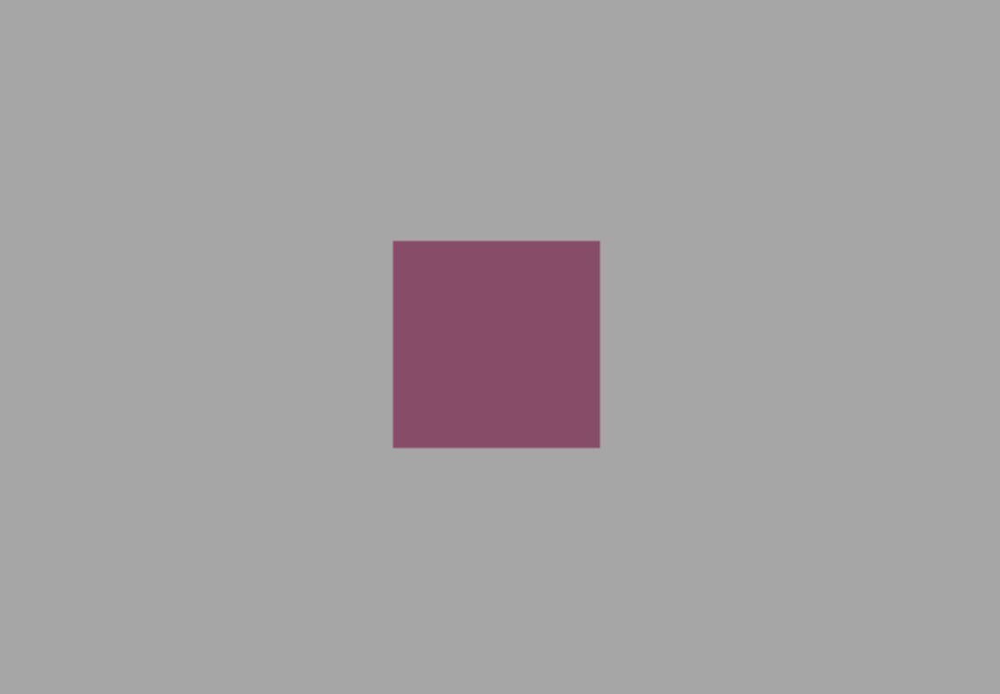

Yeahi :) we have a cube, but we can't really move around it. Let's add OrbitControls - a library that enables us to move around the space. 

Add this above the //GEOMETRY tag:
```js
// CONTROLS FOR NAVIGATION
let controls = new THREE.OrbitControls(camera, renderer.domElement);
```

and add controls.update(); into our animate loop:
```js
// ANIMATE LOOP
function animate() {
    requestAnimationFrame(animate);

    controls.update();
    renderer.render(scene, camera);
}
```
Now try dragging the mouse across your scene and zooming in and out by scrolling.

We still can't really make out the edges of the cube. Let's add another light below the ambient light.

```js
// LIGHTING
let ambientLight = new THREE.AmbientLight(0xffffff, 0.8);
// add the ambient light to the scene
scene.add(ambientLight);

let pointLight = new THREE.PointLight(0xc9efff, 0.8);
pointLight.position.set(0, 4, 2);
// shadow settings
pointLight.castShadow = true;
pointLight.shadow.mapSize.width = 1024;
pointLight.shadow.mapSize.height = 1024;
pointLight.shadow.camera.near = 1;
pointLight.shadow.camera.far = 600;
pointLight.shadow.radius = 10;
// add the point light to the scene
scene.add(pointLight);

const sphereSize = 1;
const pointLightHelper = new THREE.PointLightHelper(pointLight, sphereSize);
// add the point light helper to the scene
scene.add(pointLightHelper);
```

The **pointLightHelper** is a frame around the light so we can see where it is positioned in our space. Try zooming out a bit too see it. You can also leave it out, but sometimes it is helpful when designing a scene.

To make our scene a bit more exciting, we will add some animation. One easy way to do this is incrementing the rotation value of the mesh.

Add the following right below the requestAnimationFrame(animate) function:
```js
mesh.rotation.x += 0.004;
mesh.rotation.y += 0.007;
```

Congratulations :) You just created your first Three.js application!

To make it prettier we can add a few more things:

Let's start with a floor plane below the mesh. Paste this below the icosahedron ```scene.add(mesh);```

```js
// FLOOR
let planeGeometry = new THREE.PlaneBufferGeometry(300, 300);
let planeMaterial = new THREE.MeshPhongMaterial({ color: '#9c9595', depthWrite: false });
let planeMesh = new THREE.Mesh(planeGeometry, planeMaterial);
planeMesh.rotation.x = -Math.PI / 2;
planeMesh.position.y = -10;
planeMesh.receiveShadow = true;
scene.add(planeMesh);
```

Nice! Now we have a floor plane and the point light is casting a shadow onto it. That is why we had to add define which mesh casts or receives shadows earlier. Additionally, we allowed shadows in the beginning with ```renderer.shadowMap.enabled = true;```.

So at the moment we can see the edge of our plane. Sometimes you might want to see it, but let's go with a soft transition to the background color to bring the focus to our object. We can do this by adding. Add the following line to our //SCENE tag:

```js
// SCENE
let scene = new THREE.Scene();
scene.background = new THREE.Color('#a6a6a6');
scene.fog = new THREE.FogExp2(scene.background, 0.02);
```
You can set the color and density of the fog with ```THREE.FogExp2(color, denisity)```.

As a last step we want to add some interactivity with a GUI. Insert this above the animation loop:
```js
// GUI
let gui = new dat.GUI({ width: 300 });
gui.open();

// get the default value 
let parameters = {
        material: icosaMaterial.color.getHex()
    };

gui.addColor(parameters, 'material').onChange(function (val) {
        icosaMaterial.color.setHex(val);
});
```

We can also add a second mesh. This time the material is set to wireframe, so we will only see the connected edges.

```js
let icosaGeometry_2 = new THREE.IcosahedronGeometry(2.0, 0); //radius, detail
let material_2 = new THREE.MeshPhongMaterial({ color: 0x2d2d2d, wireframe: true });
let icosa_2 = new THREE.Mesh(icosaGeometry_2, material_2);
scene.add(icosa_2);
```
and animate it in the animte loop:
```js
icosa_2.rotation.x += 0.008;
icosa_2.rotation.z += 0.005;
```


---
## Summary

<!--  -->

-   Three.js is a JavaScript library and API used to create and display 3D computer graphics with WebGL
-   The main components to run a Three.js project are: scene, camera, renderer, light, and 3D mesh (geometry + material)

[[1]](https://github.com/mrdoob/three.js/)

---

## Further Tutorials/ Resources

-   https://threejs.org/
-   https://discoverthreejs.com/
-   https://threejsfundamentals.org/
-   there are some cool tutorials on [medium.com](https://medium.com/@mag_ops/music-visualiser-with-three-js-web-audio-api-b30175e7b5ba)

---

## References

[[1] Github Three.js](https://github.com/mrdoob/three.js/)  
[[2] Eloquent Javascript](https://eloquentjavascript.net)  
[[3] Team Tree House](https://blog.teamtreehouse.com/i-dont-speak-your-language-frontend-vs-backend)  
[[4] Course Report](https://www.coursereport.com/blog/front-end-development-vs-back-end-development-where-to-start)

---

The End

💻 🕸 🕷
